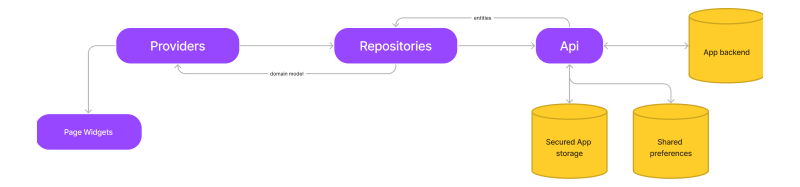
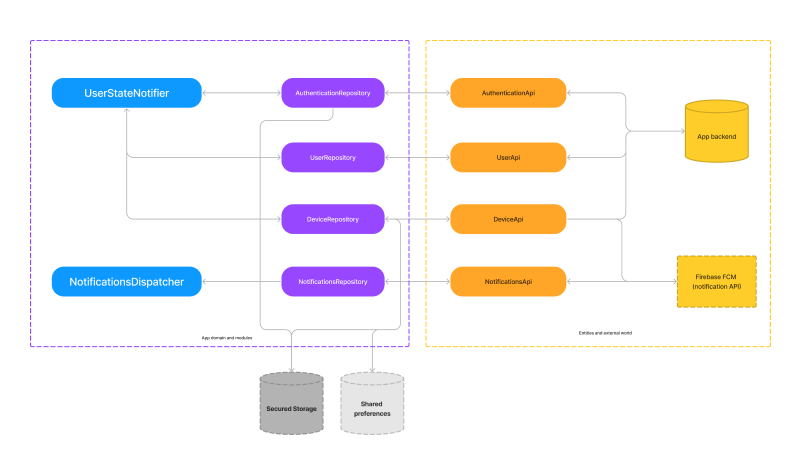

# Architecture 

This architecture is based on our experience and opinions. <br/>
There is tons of way of doing apps. <br/>
This is how we recommend today to create a really professionnal app that will scale and allow you updates with the less possible bugs. 



The entire application use this schema. <br/>
API > entities > repositories > domain model > providers > widgets




- **Api**: These are responsible of talking to the outside world 
"Don't test what you don't own" Clean architecture mantra.
- **Repositories**: These are responsible to talk to API and create your domain model. 
You should always use a repository inside your app to get Data. Never API. 
- **UserStateNotifier**: is an example of a global state. 
You will be able to listen to an immutable user state in your whole application. 
This means that you don't have to get user informations everywhere (because you will use them a lot). 
- **NotificationsDispatcher**: You will be able to listen from this everywhere in your app, and use their contained data to react properly if you need to. 
Notifications are the most powerfull things you can use in a mobile app. 


## Core module
This is where we have all the components shared across our modules. 
The less thing it contains the happyer you are. <br/>
Ex: UserState is used all over your app so we have put it in the core. 

An other example is our HttpClient that is used by all our API. <br>
It's responsible to add authentication if needed etc... 
We don't want to duplicate this everywhere.


## Building a module
A module is not a single page. It's a complete feature or epic. 
Ex: subscription
- subscribe page
- unsubscribe page
- payment 
-... 

You must use this as a complete independant world.
**Never use a model or something of an other modules. Every modules should never talk with each other**.
If you need them to talk you have to create a middleware in your core. 

Of course you will have to create routes in your main or routes file.<br>
In a perfect world if you want to remove a module, this should not have consequence on your app. 
Try to delete it and see how it impacts your app. 

### Folder structure

```
├── core
│   ├── bottom_menu // bottom menu module 
│   ├── data 
│   │   ├── api // httpclient and api extensions + core api
│   │   ├── entities // function to help you create entities from json etc...
│   │   └── models 
│   ├── guards // guards are used to protect routes
│   ├── initializer // app initializer 
│   │   └── models
│   ├── rating // module that can be used by other modules
│   ├── security // security module (store user token, etc)
│   ├── shared_preferences // shared preferences module (store user preferences...)
│   ├── states // contains all the global states (user states)
│   │   └── models // models used by states
│   └── widgets
└── modules
    └── module_1
        ├── api
        │   └── entities // entities returned by api
        ├── domain // domain models returned by repositories
        ├── providers // riverpod providers for handling UI states
        │   └── models // models used by providers (states)
        ├── repositories // repositories are used to get domain from api
        └── ui // ui folder (pages, widgets, components, etc...)
            ├── component // a component use a provider and is a widget  
            └── widgets // a widget is dumb 
```