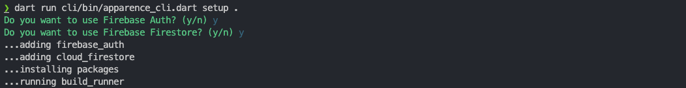

# Using Firebase auth and firestore
Before starting, make sure you have followed the [Getting started guide](./install.md) and have a working project and firebase configuration file.

## Using the CLI 
ApparenceKit has a CLI that can help you setup your project and switch from custom backend api to Firebase/Firestore. <br/>

```bash
dart pub global run apparence_cli setup .
```
or

```bash
dart run cli/bin/apparence_cli.dart setup .
```



The CLI will replace all the required files and setup your project for you.
- all API files will be replaced with a firebase implementation
- all entities will be replaced with a firebase implementation

Either you can do it manually by following the steps below.


## Manually adding Firebase auth and firestore to your project

### Using Firebase Authentication

Firebase Authentication provides backend services, easy-to-use SDKs, and ready-made UI libraries to authenticate users to your app. It supports authentication using passwords, phone numbers, popular federated identity providers like Google, Facebook and Twitter, and more.

To use it with this started please follow the steps below:

1. Go to the [Firebase Console](https://console.firebase.google.com/) and create a new project.
2. Go to the **Authentication** section and enable the desired authentication methods.
3. Update your firebase configuration in the `lib/firebase_options_[env].dart` file.
4. Update your `pubspec.yaml` file with the following command:
```bash
flutter pub add firebase_auth
```
5. Run `flutter pub get` to install the required dependencies.
6. Update the `lib/modules/authentication/api`

```dart
import 'package:apparence_kit/modules/authentication/api/entities/user_entity.dart';
import 'package:firebase_auth/firebase_auth.dart';
import 'package:flutter_riverpod/flutter_riverpod.dart';

final authenticationApiProvider = Provider<AuthenticationApi>(
  (ref) => AuthenticationApi(FirebaseAuth.instance),
);

class AuthenticationApi {
  final FirebaseAuth _auth;

  AuthenticationApi(this._auth);

  Stream<Credentials?> onAuthStateChange() {
    return _auth.authStateChanges().map((user) {
      if (user == null) {
        return null;
      }
      return Credentials(
        id: user.uid,
      );
    });
  }

  Future<Credentials?> getCurrent() async {
    final user = _auth.currentUser;
    if (user != null) {
      return Future.value(Credentials(id: user.uid));
    }
    return null;
  }

  Future<void> signinAnonymously() {
    return _auth.signInAnonymously();
  }

  Future<void> signOut() {
    return _auth.signOut();
  }
}

```

- We wrap the `FirebaseAuth` instance in a provider so that we can fake or mock it in our tests.
(FirebaseAuth is a singleton and cannot be mocked directly)
- We wrap the returned `User` object in a `Credentials` object to decouple our app from the firebase sdk. (It's basically a complete pain to create a mock of the `User` object. Making testing a nightmare.)


## Using Firebase Cloud Firestore

This will be really easy to do. 

1. For every api you want to create, create a new collection in your firestore database.
2. Create a new file `lib/modules/[module_name]/api/[api_name]_api.dart`

And use it like for User Api:

```dart
import 'package:apparence_kit/modules/authentication/api/entities/user_entity.dart';
import 'package:cloud_firestore/cloud_firestore.dart';
import 'package:flutter_riverpod/flutter_riverpod.dart';

final userApiProvider = Provider<UserApi>(
  (ref) => UserApi(
    client: FirebaseFirestore.instance,
  ),
);

class UserApi {
  final FirebaseFirestore _client;

  UserApi({
    required FirebaseFirestore client,
  }) : _client = client;

  CollectionReference<UserEntity?> get _collection =>
      _client.collection('users').withConverter(
            fromFirestore: (snapshot, _) {
              if (snapshot.exists) {
                return UserEntity.fromJson(snapshot.id, snapshot.data()!);
              }
              return null;
            },
            toFirestore: (data, _) => data!.toJson(),
          );

  Future<UserEntity?> get(String id) async {
    return _collection.doc(id).get().then((value) => value.data());
  }

  Future<void> update(UserEntity user) async {
    await _collection.doc(user.id).set(user);
  }

  Future<void> delete(String id) async {
    await _collection.doc(id).delete();
  }

  Future<void> create(UserEntity user) async {
    if (user.id == null) {
      throw Exception('User id cannot be null');
    }
    await _collection.doc(user.id).set(user);
  }
}
```

## Parsing JSON

To parse JSON we use the [json_serializable](https://pub.dev/packages/json_serializable) package.
And freezed to generate the required boilerplate code. [Check freezed documentation](https://pub.dev/packages/freezed)

For example, to parse a question entity:
```dart
import 'package:apparence_kit/core/data/entities/json_converters.dart';
import 'package:freezed_annotation/freezed_annotation.dart';

part 'question_entity.freezed.dart';
part 'question_entity.g.dart';

@freezed
class QuestionTranslationEntity with _$QuestionTranslationEntity {
  factory QuestionTranslationEntity({
    @JsonKey(toJson: Converters.id) String? id,
    required String question,
    required Map<int, String> choices,
  }) = QuestionTranslationEntityData;

  factory QuestionTranslationEntity.fromJson(
          String id, Map<String, dynamic> json) =>
      _$QuestionTranslationEntityFromJson(json..['id'] = id);
}
```

- `@freezed` tells the code generator to create union type and all required boilerplate code.
- `@JsonKey(toJson: Converters.id)` tells the code generator to use the `Converters.id` function to serialize the `id` field. (This will remove the `id` field from the json object as firestore stores ID as the document id)
- `_$QuestionTranslationEntityFromJson` is the factory method that will be used to parse the json object.
- A toJson method is automatically generated.

**Don't forget to run the build runner command after each changes `dart run build_runner build --delete-conflicting-outputs`**

### Parse date

You can use @TimestampConverter like this in your entities:
```dart
@freezed
class QuestionTranslationEntity with _$QuestionTranslationEntity {
  factory QuestionTranslationEntity({
    ...
    @TimestampConverter() required DateTime creationDate, // <-- here
  }) = QuestionTranslationEntityData;
}
```

don't forget to import it from `lib/core/data/entities/json_converters.dart`